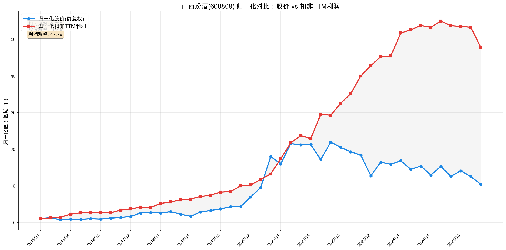
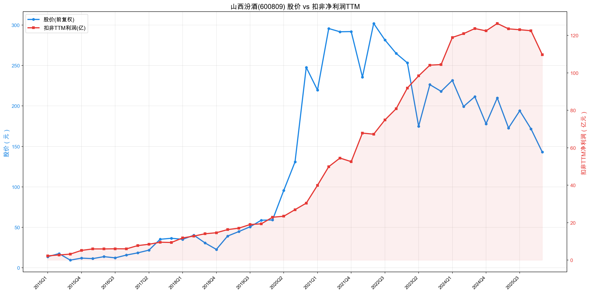
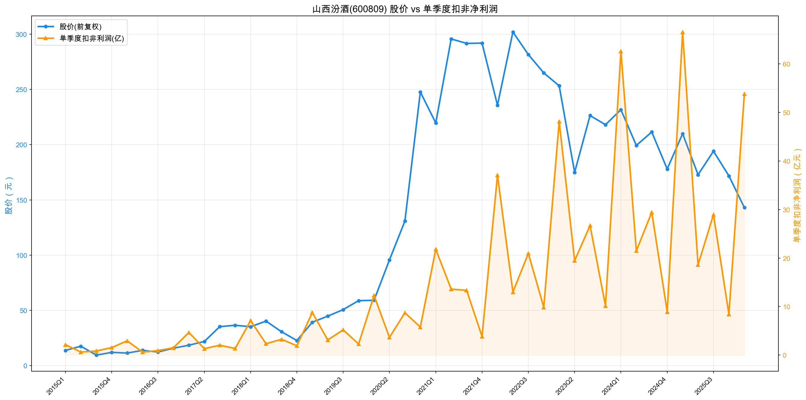

# 山西汾酒(600809) 投资分析报告

> 分析日期：2026年5月29日 | 股价：128.3元 | 市值：1,565亿元

---

## 一、公司概况

山西杏花村汾酒厂股份有限公司，1994年在上交所上市，是中国老牌名酒企业，"汾老大"曾经是白酒行业第一品牌。

- **主营业务**：汾酒、竹叶青酒、杏花村系列酒的生产、销售
- **产品结构**：酒类销售99.68%，其他业务0.32%——几乎100%是白酒
- **实际控制人**：山西省国资委（通过汾酒集团持股56.65%）
- **现任董事长**：袁清茂
- **总股本**：12.20亿股
- **员工数**：14,026人
- **上市时间**：1994年1月6日

---

## 二、排除清单（红线检查）

| 检查项 | 结果 | 说明 |
|--------|------|------|
| 财务造假嫌疑 | ✅ 通过 | 审计标准无保留意见，经营现金流与利润匹配 |
| 频繁跨界并购 | ✅ 通过 | 专注白酒主业，无跨界 |
| 大股东减持 | ✅ 通过 | 山西省国资委持股稳定 |
| 股权质押 | ✅ 通过 | 无高比例质押 |
| 应收/存货异常 | ✅ 通过 | 白酒行业存货越陈越值钱，存货增加是正面信号 |

**结论：无红线风险。**

---

## 三、好行业（Right Business）

### 竞争格局

白酒行业"一超多强"：
- **贵州茅台**：超高端绝对龙头，市值15,951亿，PE 19.3
- **五粮液**：浓香龙头，市值3,163亿，PE 25.1
- **山西汾酒**：清香型龙头，市值1,539亿，PE 14.0
- **泸州老窖**：浓香次高端，市值1,310亿，PE 13.2
- **洋河股份**：浓香中端，市值661亿，PE 65.1（利润大幅下滑）
- **古井贡酒**：徽酒龙头，市值486亿，PE 17.2

汾酒是清香型白酒的绝对代表，品类地位独特。但与茅台、五粮液相比，品牌力和定价权有明显差距。

### 行业成长性

白酒行业正处于**下行周期**，2025年头部酒企利润全线下滑：

| 公司 | 2024扣非增速 | 2025扣非增速 |
|------|------------|------------|
| 贵州茅台 | +15.4% | -4.6% |
| 五粮液 | +5.4% | -72.2% |
| 山西汾酒 | +17.2% | +0.1% |
| 泸州老窖 | +1.9% | -19.7% |
| 洋河股份 | -30.6% | -68.8% |
| 古井贡酒 | +21.4% | -36.1% |

- 行业总量在下降（人口减少、年轻人饮酒习惯变化），**结构升级**的故事已经讲完
- 2024年增速已放缓（茅台+15%、五粮液+5%、老窖+2%），2025年全面转负
- 次高端（300-800元）竞争最激烈，汾酒主力产品正好在这个区间
- **白酒行业目前没有增长，全行业在"挤泡沫"**

### 行业壁垒

- **品牌壁垒**：名酒品牌不可复制，汾酒有6000年酿造历史
- **产能壁垒**：优质白酒产能受地理环境限制
- **渠道壁垒**：经销商网络建设需要多年积累
- **文化壁垒**：白酒是中国文化的一部分，消费粘性极强

**好行业评分：14/20**
- 竞争格局：5/7（多强混战，茅台一骑绝尘，汾酒在次高端有优势但不是绝对龙头）
- 行业成长性：3/7（全行业下行周期，2025年头部酒企利润全线下滑）
- 行业壁垒：6/6（品牌+产能+文化三重壁垒）

---

## 四、好公司·定性（Right Business + Right People）

### 护城河

- **品牌**：汾酒是中国四大名酒之一，清香型白酒的代名词
- **品类垄断**：清香型白酒中，汾酒没有同等量级的竞争对手
- **重复购买**：白酒是典型的高复购消费品，消费粘性极强
- **文化属性**："借问酒家何处有，牧童遥指杏花村"——文化IP不可复制

### 定价权

- 青花汾酒20（53度500ml）：电商日常350-380元，线下420-450元
- 青花汾酒30·复兴版（53度500ml）：电商日常850-950元，线下900-1000元
- 近年持续提价，毛利率从2021年74.9%提升至2024年76.2%（2025年微降至74.9%）
- 但与茅台相比，汾酒的提价空间有限——清香型白酒的高端化天花板低于酱香型

### 管理层质量

- **实际控制人**：山西省国资委（通过汾酒集团持股56.65%）——绝对控股
- **第二大股东**：华润系（华创鑫睿(香港)有限公司）持股约10.5%，为第二大股东
- **华润与汾酒的关系**：
  - 2018年混改引入华润，华润曾派驻2名董事+多名经营层高管，深度参与销售、财务、战略
  - 2025年后华润逐步淡出：2026年4月华润创业总裁王彦辞任董事，仅保留1席（马文杰，华润创业CFO）
  - **当前状态**：华润有1名董事（9人董事会），参与董事会决策和财务监督，但不参与日常经营管理
  - 经营团队完全由汾酒本土团队主导
- **现任董事长袁清茂**：汾酒本土干部，延续"复兴"战略
- **利益绑定**：华润作为财务投资者+战略协同方（渠道、数字化、科研），有一定的利益绑定
- **评价**：华润的介入提升了汾酒的治理水平（混改后ROE从15%提升到44%），但华润正在"退居二线"，未来治理改善的边际效应在减弱

**好公司·定性评分：16/20**
- 护城河：7/8（品牌+品类垄断+高复购，但高端化天花板有限）
- 定价权：4/6（有提价能力，但不如茅台/五粮液）
- 管理层：5/6（华润混改提升治理水平，华润逐步淡出但仍有1名董事监督）

---

## 五、好公司·定量

### 5.1 盈利能力：杜邦分析

| 年份 | ROE | 净利率 | 周转率 | 权益乘数 | 驱动模式 |
|------|-----|--------|--------|----------|----------|
| 2021 | 42.0% | 27.0% | 0.67x | 1.92x | 效益型 |
| 2022 | 44.7% | 31.1% | 0.71x | 1.69x | 效益型 |
| 2023 | 43.1% | 32.8% | 0.72x | 1.56x | 效益型 |
| 2024 | 39.7% | 34.0% | 0.67x | 1.52x | 效益型 |
| 2025 | 33.5% | 31.8% | 0.69x | 1.40x | 效益型 |

**趋势解读**：
- ROE从2022年高点44.7%下降到2025年33.5%——趋势在恶化
- **净利率**先升后降：从27%→34%→31.8%，2025年回落
- **周转率**基本稳定（0.67-0.72x）
- **权益乘数**持续下降（1.92→1.40x）——去杠杆，这是正面信号
- **结论：ROE下降主要因为净利率回落+去杠杆，不是经营恶化，但增长确实在放缓**

### 5.2 扣非净利润增长

| 年份 | 营收(亿) | 增速 | 扣非净利(亿) | 增速 | 毛利率 | 净利率 |
|------|----------|------|-------------|------|--------|--------|
| 2021 | 199.7 | -- | 52.6 | -- | 74.9% | 26.6% |
| 2022 | 262.1 | 31.3% | 80.9 | 53.8% | 75.4% | 30.9% |
| 2023 | 319.3 | 21.8% | 104.5 | 29.2% | 75.3% | 32.7% |
| 2024 | 360.1 | 12.8% | 122.5 | 17.2% | 76.2% | 34.0% |
| 2025 | 387.2 | 7.5% | 122.5 | 0.1% | 74.9% | 31.6% |

- **4年CAGR(2021-2025)**：营收18.0%，扣非净利23.5%
- **3年CAGR(2022-2025)**：扣非净利14.9%
- **2025年扣非增速仅0.1%**——利润基本停滞
- **2026Q1 TTM = 109.8亿，同比下降13.2%**——利润在下滑

**增速放缓趋势非常明显**：从2022年的53.8%→29.2%→17.2%→0.1%→负增长。

### 5.3 经营质量

**经营现金流 vs 净利润：**

| 年份 | 经营现金流(亿) | 净利润(亿) | 比值 |
|------|---------------|-----------|------|
| 2021 | 76.5 | 53.1 | 1.44 |
| 2022 | 103.1 | 81.0 | 1.27 |
| 2023 | 72.3 | 104.4 | 0.69 |
| 2024 | 121.7 | 122.4 | 0.99 |
| 2025 | 90.1 | 122.5 | 0.74 |

- 2023年和2025年经营现金流低于净利润——这是白酒行业共性（经销商打款节奏），不能直接判为"含金量低"
- 但2025年现金流大幅下降（从121.7→90.1亿），需要关注

### 5.4 现金头寸

**计算公式**：现金头寸 = 现金等价物(货币资金) + 定期存款(其他流动资产) + 有价证券(交易性金融资产) - 长期负债

> 注：定期存款计入现金头寸，因年报附注确认其他流动资产中主要为短期定期存款，属于高流动性现金等价物。

**2026Q1数据：**
- 现金等价物（货币资金）：125.1亿
- 定期存款（其他流动资产）：246.5亿（年报附注确认为短期定期存款）
- 有价证券（交易性金融资产）：0亿
- 长期负债：0.2亿
- **净现金** = 125.1 + 246.5 + 0 - 0.2 = **371.4亿**
- **每股净现金** = 371.4 / 12.2 = **30.44元**，占股价23.7%

**2025年报数据：**
- 现金等价物：97.7亿，定期存款：194.7亿，有价证券：0亿，长期负债：2.0亿
- 净现金 = 97.7 + 194.7 + 0 - 2.0 = **290.4亿**，每股23.8元，占股价18.6%

**历史趋势：**
| 年份 | 现金等价物 | 定期存款 | 有价证券 | 长期负债 | 净现金(亿) | 每股(元) |
|------|-----------|---------|---------|---------|-----------|---------|
| 2021 | 61.5 | 2.4 | 60.3 | 0.3 | 123.9 | 10.2 |
| 2022 | 112.0 | 61.1 | 10.6 | 0.2 | 183.6 | 15.0 |
| 2023 | 37.7 | 174.6 | 0.5 | 8.8 | 204.1 | 16.7 |
| 2024 | 62.8 | 209.9 | 0 | 5.5 | 267.3 | 21.9 |
| 2025 | 97.7 | 194.7 | 0 | 2.0 | 290.4 | 23.8 |
| 2026Q1 | 125.1 | 246.5 | 0 | 0.2 | 371.4 | 30.44 |

- 零有息负债（无长借、无债券），仅有微量租赁负债
- 定期存款占比持续上升（从2021年2.4亿增至2026Q1的246.5亿），反映公司资金沉淀能力强
- 每股净现金从2021年10.2元增长至2026Q1的30.44元，5年增长近3倍

### 5.5 产品结构

- **酒类销售**：99.68%（几乎100%）
- **其他业务**：0.32%
- 产品高度集中于白酒，无第二曲线
- 核心大单品：青花汾酒系列（次高端300-1000元价位段）
- 竹叶青酒（保健酒）体量较小

**好公司·定量评分：33/40**
- ROE质量：6/8（ROE>33%，效益型驱动，但趋势从44.7%下降到33.5%）
- 利润增长(CAGR)：5/8（4年CAGR 23.5%不错，但增速已放缓至0%，2026Q1在下滑）
- 毛利率/净利率趋势：4/5（毛利率>74%优秀，但2025年净利率回落至31.8%）
- 经营现金流vs利润：4/5（白酒行业特殊性，现金流波动但整体可接受）
- 存货/应收vs营收：4/4（白酒存货越陈越值钱，不适用常规判断）
- 现金头寸：4/4（每股净现金30.44元，占股价23.7%，零有息负债）
- 负债率：3/3（28.7%，极低）
- 产品结构：2/3（大单品稳固，但无第二曲线，100%依赖白酒）

---

## 六、好时机（Right Price）

### 6.1 股价走势分析

**图1：归一化对比**

相关系数0.729——股价与利润走势有一定相关性但不完全同步。利润涨47.7倍，股价只涨10.4倍，PE大幅压缩。

**图2：股价 + 扣非TTM利润**

左轴蓝色线=股价，右轴红色线=扣非TTM利润。利润线持续上行创新高，股价线从2021年高点315元跌至128元。

**图3：股价 + 单季度扣非利润**

左轴蓝色线=股价，右轴橙色线=单季度扣非利润。Q1利润最高（春节旺季），Q4最低，季节性明显。

**近期走势**：
- 2021年高点315元（PE约73倍），此后持续下跌至128元，跌幅59%
- 下跌原因：2021年泡沫破裂 + 白酒行业增速放缓 + 2026Q1利润下滑
- 基本面：2025年扣非停滞（+0.1%），2026Q1 TTM同比下降13.2%

### 6.2 估值指标

**PE及PE百分位**：
- 当前PE(TTM) = 14.02（基于扣非TTM 109.8亿 / 12.2亿股 = 9.00元EPS）
- PE百分位 = **0.6%**（基于2018-2026年约2000个交易日数据）
- 历史PE范围：13.5 ~ 147.9
- PE中位数：37.5
- **结论：当前PE处于近8年历史最低0.6%分位，极度低估区间**
- 注意：这个百分位包含了2020-2021年泡沫期（PE 50-150倍），如果排除泡沫期，百分位会更高

**PEG**：
- 3年CAGR = 14.9%
- PEG = 14.02 / 14.9 = **0.94**
- 处于彼得林奇合理区间上沿（0.5-1）
- **但增速在放缓**：2025年扣非增速0.1%，2026Q1 TTM下降13.2%。如果用未来预期增速（可能5-10%），PEG会更高

**收益分解（2021年高点~2026.5）**：
- 股价：315元 → 128元（-59%）
- EPS：4.31元 → 9.00元（+109%）
  - PE：73.1 → 14.2（-81%）
- **利润贡献-93%，PE贡献193%**——股价下跌完全是PE压缩导致
- 利润翻倍了，但PE从73倍压到16倍，股价反而腰斩

### 6.3 股息率

| 年度 | 每股分红(元) | 股息率(当时股价) |
|------|------------|----------------|
| 2021 | 1.80 | 0.6% |
| 2022 | 3.32 | 1.3% |
| 2023 | 4.37 | 2.0% |
| 2024 | 3.60 | 2.0% |
| 2025 | 6.56 | 3.8% |

- 2025年分红6.56元/股，按当前股价128.3元算，**股息率5.1%**
- 分红持续增长（从1.80元到6.56元），分红率约54%
- 股息率5.1%+PE百分位0.6%，完美符合西格尔"高股息+低估值"策略

### 6.4 机构+内部人

- 机构持股比例高（沪股通标的、MSCI成分股）
- 山西省国资委持股56.65%稳定
- 无大股东减持信号

### 6.5 预期差

- **市场主流担忧**：白酒行业增速放缓、2026Q1利润下滑、次高端竞争加剧
- **预期差所在**：
  - 市场给14倍PE，隐含的是利润零增长甚至负增长的预期
  - 但汾酒的清香型品类地位独特，长期仍有提价+结构升级空间
  - 如果2026年利润只是小幅下滑（-10%以内）而非大幅恶化，当前估值有修复空间
  - 股息率5.1%提供了安全垫——即使股价不涨，分红回报也超过银行理财

### 6.6 毛估估

> **周期性判断**：白酒行业属于弱周期/消费属性行业，历史上利润波动主要受政策（反腐）和行业景气影响，不是典型的经济周期行业。但2025-2026年确实处于增速放缓的"小周期"低谷。以下分档估算。

**乐观（未来3年CAGR 15%）**：行业回暖，汾酒恢复增长
- 2028年扣非TTM ≈ 109.8 × 1.15³ = 167亿
- 给20-25PE → 市值3,340-4,175亿 → 股价274-342元
- 当前128元，空间114%-167%

**中性（未来3年CAGR 10%）**：行业平稳，汾酒温和增长
- 2028年扣非TTM ≈ 109.8 × 1.10³ = 146亿
- 给15-20PE → 市值2,190-2,920亿 → 股价180-239元
- 当前128元，空间41%-87%

**保守（未来3年CAGR 5%，行业持续低迷）**：
- 2028年扣非TTM ≈ 109.8 × 1.05³ = 127亿
- 给12-15PE → 市值1,524-1,905亿 → 股价125-156元
- 当前128元，空间-2%~+22%
- 如果PE回到10倍（极端悲观），股价可能只有104元，亏损19%

**周期性风险**：
- 2026Q1 TTM已经同比下降13.2%，如果持续下滑，利润可能回到100亿以下
- 白酒行业"量减价升"的故事可能接近尾声
- 次高端竞争加剧（酱酒热降温后，清香型是否能持续抢份额存疑）
- 国企管理层换届可能影响战略连续性

**结论：当前PE 14倍处于历史最低，股息率5.1%提供安全垫。但增速放缓是实实在在的风险，保守情况下可能没有正收益。适合有耐心的长期投资者分批建仓，不适合追求短期收益。**

**好时机评分：15/20**
- 股价vs利润线：3/5（利润创新高但股价腰斩，趋势背离——利润上行股价下行）
- PE百分位：4/4（0.6%，历史最低区间）
- PEG：2/3（0.94合理区间上沿，但增速在放缓，PEG参考价值下降）
- 股息率：3/3（5.1%，高股息+低PE）
- 机构+内部人+回购：2/3（机构重仓，国资委稳定，无回购）
- 预期差：1/2（市场担忧有道理，预期差存在但不确定）

---

## 七、维度打分汇总表

| 大类 | 维度 | 分值 | 得分 | 说明 |
|------|------|------|------|------|
| **好行业** | 竞争格局 | 7 | 5 | 多强混战，茅台一骑绝尘 |
| | 行业成长性 | 7 | 3 | 全行业下行周期，2025年头部酒企利润全线下滑 |
| | 行业壁垒 | 6 | 6 | 品牌+产能+文化三重壁垒 |
| | **小计** | **20** | **14** | |
| **好公司·定性** | 护城河 | 8 | 7 | 品类垄断+高复购，高端化天花板有限 |
| | 定价权 | 6 | 4 | 有提价能力，但不如茅台/五粮液 |
| | 管理层 | 6 | 5 | 华润混改提升治理，华润逐步淡出但仍有1名董事 |
| | **小计** | **20** | **16** | |
| **好公司·定量** | ROE质量 | 8 | 6 | ROE>33%但趋势从44.7%降至33.5% |
| | 利润增长(CAGR) | 8 | 5 | 4年CAGR 23.5%但已放缓至0% |
| | 毛利率/净利率趋势 | 5 | 4 | 毛利率>74%优秀，净利率2025年回落 |
| | 经营现金流vs利润 | 5 | 4 | 白酒行业特殊性，整体可接受 |
| | 存货/应收vs营收 | 4 | 4 | 白酒存货越陈越值钱 |
| | 现金头寸 | 4 | 4 | 每股净现金30.44元，占股价23.7%，零有息负债 |
| | 负债率 | 3 | 3 | 28.7%，极低 |
| | 产品结构 | 3 | 2 | 大单品稳固，但100%依赖白酒 |
| | **小计** | **40** | **32** | |
| **好时机** | 股价vs利润线 | 5 | 3 | 利润上行但股价腰斩，趋势背离 |
| | PE百分位 | 4 | 4 | 0.6%，历史最低 |
| | PEG | 3 | 2 | 0.94合理但增速放缓 |
| | 股息率 | 3 | 3 | 5.1%，高股息+低PE |
| | 机构+内部人+回购 | 3 | 2 | 机构重仓，国资委稳定 |
| | 预期差 | 2 | 1 | 市场担忧有道理 |
| | **小计** | **20** | **15** | |
| **总计** | | **100** | **77** | **关注** |

---

## 八、总结

### 核心结论

**山西汾酒是一家好公司，当前处于"合理偏低"的价格区间，但增速放缓是实实在在的风险。**

**Right Business ✅**：清香型白酒绝对龙头，品牌壁垒深厚，白酒是永续消费品。

**Right People ⚠️**：国企管理层执行力不错，但利益绑定有限，战略连续性存在不确定性。

**Right Price ✅（有条件）**：
- PE 14倍，处于近8年历史最低0.6%分位
- 股息率5.1%，分红逐年增长
- 但2025年利润停滞，2026Q1 TTM下降13.2%
- 增速从53.8%→29.2%→17.2%→0.1%→负增长，趋势明确向下

### 风险提示

1. **增速持续放缓**：2026Q1 TTM已下降13.2%，如果持续恶化，PE可能进一步压缩
2. **白酒行业见顶**：量减价升的故事可能接近尾声
3. **次高端竞争加剧**：酱酒热降温后，各品牌都在抢占次高端市场
4. **国企管理层换届风险**：政府任命的管理层可能不如民企稳定
5. **估值陷阱**：低PE可能不是"便宜"，而是市场对增速放缓的合理定价

### 一句话

**好公司，合理偏低的价格，但不是"捡便宜"的时候。** 汾酒的PE百分位0.6%和股息率5.1%看起来很诱人，但增速从53.8%骤降到0.1%是不争的事实。如果相信白酒行业长期不会消亡、汾酒的品类地位不会动摇，当前价格是值得分批建仓的；但如果担心增速继续恶化，等待利润企稳信号再入场也不迟。**低PE不等于低估，增速放缓时PE可以更低，投资需要耐心。**

---

*注：本报告基于同花顺导出数据（主）、东方财富API、公司公告等公开信息编写，不构成投资建议。财务数据以同花顺导出为准，东方财富API作为交叉验证。券商盈利预测未纳入分析。*
