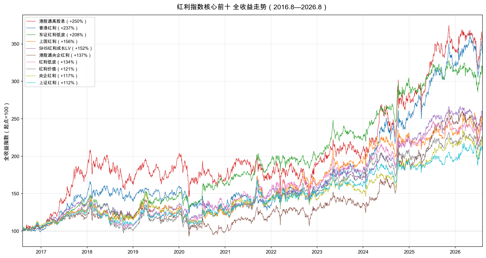

# 30只红利指数筛了三遍，我只留下这10只

如果你在2021年初随便买一只红利指数，拿到现在大概率是赚钱的。但"赚钱"和"拿得住"是两回事。

30只红利类指数，同样是2021年初买入，到2026年8月，总收益最高的香港红利涨了144%，最低的消费红利亏了15%，中间差了160个百分点。即便在前十里，2019到2021那三年，香港红利连续跑输大多数同类指数，有多少人能在那个时候不换车？

这篇文章不讨论"红利策略好不好"，只解决一个问题：30只名字里带"红利"的指数，经过三轮筛选后，哪些值得长期持有。

## 一、增长率陷阱：为什么慢公司反而赢

沃顿商学院教授杰里米·西格尔在《投资者的未来》里做过一个著名研究。他追踪了1957年到2003年标普500的原始成分股，计算每只股票46年间给投资者带来的回报。

结果出乎大多数人意料：回报最高的不是IBM这样的科技王者，而是新泽西标准石油——后来的埃克森美孚。一家石油公司，在一个被认为"没有增长"的行业里，靠便宜的股价和持续的股息，跑赢了整个计算机革命的代表。

西格尔把这个现象称为"增长率陷阱"：新兴行业吸引大量资本涌入，投资者为"预期增长"支付过高价格，一旦实际增长低于预期，估值和盈利双杀；而慢速增长行业里的龙头，市场预期低、估值便宜、股息稳定，股息在熊市里买到更多份额，长期复利反而胜出。他给出的长期回报拆解很朴素——股票实际回报 ≈ 股息率 + 股息增长率 ± 估值变动，对大多数公司而言，股息贡献了回报的大头。

A股过去几年在复刻这个故事。2019-2020年核心资产牛市里，消费、新能源、医药被给予极高增长预期；2021年之后，这些板块陆续估值回归，而煤炭、银行、公用事业这些"没故事"的高股息板块持续走牛。中证红利全收益指数2021年以来连续5年正收益，而沪深300同期还没回到2021年的高点。

但高股息不等于好策略，这里有个必须补的限定：西格尔也强调要避开"价值陷阱"——盈利衰退、分红不可持续、股息率高只是因为股价在暴跌的公司。2020年的房地产、2023年之后的部分中小银行，股息率看着诱人，实则是盈利下滑的信号。这就是为什么红利类指数里会衍生出低波、质量、成长等各种叠加因子——光看股息率不够，还要确认这些分红真的能持续。

## 二、30只红利指数，大致分六类

我从中证指数官网筛选了所有"热点=红利/高股息"且有ETF跟踪产品的指数，共30只，不区分境内与跨市场。按编制方案分为六大类：

| 分类 | 只数 | 策略逻辑 | 代表指数 |
|---|---:|---|---|
| 经典红利 | 17 | 以股息率为核心筛选加权，最基础的形态 | 中证红利、上证红利、香港红利、港股通高股息 |
| 红利低波 | 6 | 在红利基础上叠加低波动因子 | 红利低波、红利低波100、东证红利低波 |
| 红利质量 | 3 | 叠加ROE、盈利稳定性等质量因子 | 红利质量、中证红利质量 |
| 红利成长 | 2 | 叠加盈利/股息增长因子 | SHS红利成长LV、红利潜力 |
| 红利价值 | 1 | 叠加PB、派息率等价值因子 | 红利价值 |
| 行业主题 | 1 | 限定在单一行业内 | 消费红利 |

数据采用人民币全收益指数（TR），现金分红再投资，截止2026年8月7日。所有指数统一计算10年（2016年8月起）、5年（2021年8月起）、3年（2023年8月起）三个窗口的CAGR、最大回撤、波动率、收益波动比和年度胜率，按相对排名百分位打分（收益40%、风险30%、效率15%、稳定性15%）。

完整评分方法和30只指数的三周期全部数据见文末附录。

## 三、筛完三轮，留下这10只

三轮筛选后留下的10只指数，按三周期平均排名排列：

| 排序 | 指数 | 分类 | 10年 | 5年 | 3年 | 均排 | 推荐标的 | 规模 |
|---:|---|---|---:|---:|---:|---:|---|---:|
| 1 | 香港红利/H11140 | 经典红利 | 5 | **1** | 2 | 2.7 | 中国平安CSI香港高息股ETF（3070 HK） | 10.87亿 |
| 2 | SHS红利成长LV/931157 | 红利成长 | 8 | 2 | **1** | 3.7 | 景顺长城沪港深红利成长低波（007751） | 34.51亿 |
| 3 | 东证红利低波/931446 | 红利低波 | **1** | 3 | 8 | 4.0 | 东方红中证红利低波动指数（012708） | 65.11亿 |
| 4 | 港股通高股息/930914 | 经典红利 | 10 | 12 | 3 | 8.3 ⚠ | 华泰柏瑞港股通高股息ETF（513530） | 42.71亿 |
| 5 | 上国红利/000151 | 经典红利 | 6 | 14 | 12 | 10.7 | 国泰上证国企红利ETF（510720） | 21.76亿 |
| 6 | 港股通央企红利/931233 | 经典红利 | 26 | 8 | 6 | 13.3 | 华夏港股通央企红利ETF（513910） | 32.47亿 |
| 7 | 红利低波/H30269 | 红利低波 | 18 | 9 | 21 | 16.0 | 华泰柏瑞红利低波ETF（512890） | 324.14亿 |
| 8 | 上证红利/000015 | 经典红利 | 20 | 18 | 16 | 18.0 | 上证红利ETF（510880） | 213.18亿 |
| 9 | 央企红利/000825 | 经典红利 | 24 | 21 | 18 | 21.0 | 华泰柏瑞央企红利ETF（561580） | 26.98亿 |
| 10 | 红利价值/H30270 | 红利价值 | 27 | 16 | 20 | 21.0 | 易方达红利价值ETF（563700） | 4.16亿 |

> 排名数字为该周期在30只中的位置，均排为三周期排名算术平均。⚠ 港股通高股息：发布前回测段CAGR比实盘段高10.61个百分点，策略发布后超额收益在衰减。⚠ 香港红利：2019-2021连续三年年度收益排后10名（+10.6%/-16.6%/+1.2%），5年#1主要由2024年+43.7%和2025年+23.6%拉动，存在"忍耐三年、爆发两年"的路径依赖。

> 全收益指数（现金分红再投资），2016年8月8日起点归一化为100。图例按期末累计收益降序排列。香港红利（蓝线）2018-2023长期横盘，2024年后才陡直拉升；东证红利低波（绿线）斜率最稳定、回撤最小。

几个要点：

- 东证红利低波10年总分第一（92.0分），SHS红利成长LV 3年和5年都在前3，这两只是三周期都没有明显短板的指数。
- 香港红利5年和3年排名最靠前，但10年只排第5，2019-2021牛市期间持续跑输A股同类，属于"前期忍耐、后期爆发"的路径，这个后面会展开说。
- 红利低波（512890）业绩只排第7，但324亿规模是场内流动性最好的红利ETF，适合资金量大、需要随时进出的投资者。
- 央企红利和红利价值平均排名21，是前十的守门员，没有硬伤但也没有突出优势，更适合作为卫星配置而非核心。

## 四、三轮筛选，每轮淘汰了谁

筛选顺序有讲究：先砍数据水分，再砍投资门槛，最后才看业绩——因为一只指数如果数据不可信或根本买不到，业绩再好也没有意义。

**第一轮：回溯数据可信度。** 30只中有7只是2022年之后发布的，10年数据里超过60%是指数公司用当前规则反算的模拟序列，不是实盘。这种数据跟发布超过10年的指数同台排名不公平。我把这7只降到观察池，不参与核心排名。另有3只虽然回溯占比不高，但发布前后CAGR落差超过10个百分点，标注警示。

**第二轮：可投资性。** ETF规模低于2亿、场外指数基金低于5亿的剔除，LOF和指数增强不优先。这轮最可惜的是上红低波——三周期排名#7/#5/#4，业绩稳定在前10，但唯一跟踪产品只有0.84亿。

**第三轮：三周期业绩一致性。** 如果10年、5年、3年中有两个周期排在后10名（#21-#30），说明业绩依赖特定市场环境，不适合作为核心持仓。这轮淘汰了6只，包括最知名的中证红利（三周期#22/#22/#23）。

**被剔除的20只：**

| 轮次 | 指数 | 关键数据 | 剔除原因 |
|---|---|---|---|
| ①回溯 | A500红利低波/932422 | 回溯86.7% | 2025年4月发布，实盘仅1年多 |
| ①回溯 | 智选高股息/932305 | 回溯81.5% | 2024年9月发布，回测排名#3但实盘短 |
| ①回溯 | 中证红利质量/932315 | 回溯79.2% | 2024年7月发布，5年实盘已滑至#24 |
| ①回溯 | 国新港股通央企红利/931722 | 回溯69.8%，落差-8.38pp | 5年/3年突入前10，但10年靠后且落差大 |
| ①回溯 | 诚通央企红利/931132 | 回溯66.0% | 排名中游（#14/#15/#19），无突出亮点 |
| ①回溯 | 央企红利50/931231 | 回溯66.0% | 排名逐轮走低（9→19→22） |
| ①回溯 | 央企股东回报/932039 | 回溯61.2% | 三周期逐季恶化（16→23→27） |
| ②规模 | 上红低波/H50040 | 场外0.84亿 | 三周期#7/#5/#4业绩优秀，但唯一产品不足5亿 |
| ②规模 | 高息策略/H30366 | ETF 1.26亿 | ETF不足2亿 |
| ②规模 | 300红利/000821 | ETF 1.60亿 | ETF不足2亿 |
| ②规模 | 国企红利/000824 | ETF 0.63亿 | ETF不足2亿 |
| ②规模 | SHS高股息/930917 | LOF 0.65亿 | LOF流动性差 |
| ②规模 | 红利潜力/H30089 | 场外0.42亿 | 场外不足5亿，且5年#29/3年#28 |
| ②规模 | 中华预期高股息/CESFHY | 增强0.62亿 | 指数增强+规模不足，10年总分3.3垫底 |
| ③一致性 | 红利质量/931468 | 5年#28、3年#29 | 两周期垫底；回测落差+11.89pp |
| ③一致性 | 红利低波100/930955 | 10年#21、3年#25 | 两周期后10；回测落差+16.38pp为全样本最大 |
| ③一致性 | 中证红利/000922 | #22/#22/#23 | 三周期全部20名开外，"标杆"名不副实 |
| ③一致性 | 消费红利/H30094 | 5年#30、3年#30 | 5年-3.28%、3年-8.31%，全样本唯一负收益 |
| ③一致性 | 300红利低波/930740 | 10年#28、3年#26 | 两周期后10，年度胜率仅5/9 |
| ③一致性 | 港股通高息精选/930839 | 10年#29、5年#26 | 两周期后10，3年虽#17但长期弱 |

降到观察池的7只里，A500红利低波（回测#2/#6/#11）和智选高股息（#3/#7/#9）数据很亮眼，但实盘都不到2年，等它们经历一轮完整牛熊再评估更稳妥。

## 五、不同需求，怎么选

不按"经典红利/红利低波"的编制方案分类讲，那是指数公司的视角。从投资者实际需求出发：

**想要最稳、能定投的：东证红利低波、红利低波**
东证红利低波10年总分第一，9个完整年度里只有1年负收益、1年排进后10名，是30只里路径最平稳的。场外基金65亿，适合定投。红利低波（512890）业绩稍逊但324亿规模、场内流动性最好，适合需要随时买卖的资金。

**想配港股、押估值修复：香港红利、港股通央企红利**
香港红利5年CAGR 19.59%，是前十里弹性最大的。但必须说清楚代价：2019年+10.6%、2020年-16.6%、2021年+1.2%，连续三年在30只里排后10名，同期中位数在15-20%。如果2021年买入，要忍到2024年才真正赚钱。港股通央企红利路径类似，2020年-21.4%是前十里最差的单年表现。这两只适合能承受3年跑输、且相信港股估值修复可持续的投资者。

**想要成长+红利的平衡：SHS红利成长LV**
这是前十里唯一一只红利成长类。3年排名第一，5年第二，10年第八，三周期都在前10且没有明显短板。同时覆盖A股和港股，成长因子和低波因子叠加，波动率仅13.3%。场外基金34亿，适合不想在"红利"和"成长"之间二选一的投资者。

**只认老牌标杆：上证红利**
2005年发布，20年实盘数据，213亿ETF规模。10年CAGR 7.81%在前十里偏低，但胜在波动和回撤都居中游，没有踩过坑。如果你不愿意相信任何"新策略"，这只最朴素。

**要避开的几只**
中证红利（000922）虽然名气最大、ETF规模179亿，但三周期排名全部在后10名，10年CAGR 8.28%低于多只同类——被产品规模和知名度掩盖了业绩平庸。消费红利5年和3年都是全样本唯一负收益，10年的正收益完全靠2019-2020那轮牛市（+137%），行业100%集中在消费，波动22%，不适合作为红利配置。

## 六、五个反直觉的发现

筛选过程中有几个数据和直觉不太一样：

**1. 名气最大的中证红利，业绩排不进前20。** 中证红利ETF规模179亿，是市场最知名的红利指数之一，但10年/5年/3年排名#22/#22/#23，三周期全部在后10名。它的问题是编制规则较老（按股息率选样、股息率加权），没有低波或质量约束，金融和原材料占比高，在2019-2020成长牛和2021-2022回调中都没占到便宜。

**2. "质量因子"在红利策略里全军覆没。** 三只红利质量指数——红利质量、中证红利质量、港股通高息精选，一只都没进核心前十。中证红利质量回测CAGR 13.98%全样本第一，但2024年7月才发布，实盘仅1年多；红利质量2020年发布，实盘5年排名#28、3年#29，回测落差+11.89pp。质量因子叠加ROE和盈利稳定性，逻辑听起来更"高级"，但在A股的实际效果还需要更长验证。

**3. 回测数据有多不可信？** 红利低波100的回测段CAGR比实盘段高16.38个百分点，是30只里最夸张的。港股通高股息回测段比实盘高10.61pp。指数公司用当前规则反算历史数据，天然带有后视镜——你知道后来哪些股票涨了，规则当然可以"设计"得看起来很准。看到任何指数的"历史回测业绩"，先找发布日期。

**4. 规模最大的产品，往往不跟踪业绩最好的指数。** 红利低波ETF（512890）324亿，但它的10年排名#18，远低于东证红利低波#1。中证红利ETF 179亿，排名#22。大基金公司倾向于跟踪发布更早、更"知名"的指数，而不是业绩最好的指数。投资者买ETF时多看一眼指数本身的业绩，不要只看基金规模和品牌。

**5. 同属"红利低波"，业绩差距能有多大？** 东证红利低波10年总分92.0排第一，300红利低波23.9排第28，同属低波策略差距悬殊。东证是定制策略，前十大成分股仅占14.83%，极度分散；300红利低波受沪深300板块限制，金融+工业占比超过50%。"红利低波"四个字只说明了因子，选股范围和加权方式才是决定业绩的关键。

## 七、最后的提醒

这篇文章的所有数据都是历史业绩。历史业绩在红利策略上比成长策略更有参考价值——红利策略赚的是股息复利和估值回归，逻辑相对稳定——但它不能预测未来。几个需要注意的局限：

- 港股红利近5年的超额收益有相当部分来自估值修复（港股从2021年的低点回升），这种修复不会每年发生。香港红利2019-2021连续三年跑输的历史可能重演。
- 10年窗口看起来长，但主要覆盖了A股价值风格占优的一段（2016-2026），如果未来风格切换到成长，红利策略可能持续跑输。
- 观察池里的7只新指数，尤其是A500红利低波和智选高股息，回测数据很好看，但回测好看的指数实盘未必跑得好，这篇文章里已经有太多先例。
- 任何单只指数都有风格集中的风险。东证红利低波前三大行业是金融、工业、公用事业；港股类指数金融+能源占比高。选2-3只不同风格的指数分散持有，比押注单只更稳妥。

数据来源为中证指数官网（全收益代码、历史Excel、持仓接口），原始数据归档在项目 `sources/` 目录下，完整指标JSON包含每只指数三个周期的CAGR、波动、回撤、胜率等全部计算结果，可独立复算。

---

## 附录

### A. 评分方法

- 回报类型：人民币全收益指数（TR），现金分红再投资
- 数据截止：2026-08-07
- 回溯区间：10年（2016-08-08起）、5年（2021-08-09起）、3年（2023-08-08起）
- 评分方法：相对排名百分位制，组内排名转0-100分，不设绝对阈值

| 维度 | 权重 | 核心指标 |
|---|---:|---|
| 收益能力 | 40% | CAGR |
| 风险控制 | 30% | 最大回撤 |
| 风险收益效率 | 15% | 收益/月频波动 |
| 稳定性 | 15% | 年度胜率60% + 滚动3年中位数40% |

每项得分 = 排名位置 ÷ 总只数 × 100，再乘以权重，四项相加为总分。总分差3-5分以内视为同档。

回溯数据可信度检验：比较发布前回溯段与发布后实盘段的CAGR落差，落差大说明后视镜偏差严重。

### B. 30只指数完整名单

**经典红利（17只）**：上证红利/000015、中证红利/000922、300红利/000821、上国红利/000151、国企红利/000824、央企红利/000825、央企红利50/931231、诚通央企红利/931132、央企股东回报/932039、香港红利/H11140、港股通高股息/930914、SHS高股息/930917、港股通央企红利/931233、国新港股通央企红利/931722、智选高股息/932305、中华预期高股息/CESFHY、高息策略/H30366

**红利低波（6只）**：红利低波/H30269、红利低波100/930955、300红利低波/930740、上红低波/H50040、东证红利低波/931446、A500红利低波/932422

**红利质量（3只）**：红利质量/931468、中证红利质量/932315、港股通高息精选/930839

**红利成长（2只）**：SHS红利成长LV/931157、红利潜力/H30089

**红利价值（1只）**：红利价值/H30270

**行业主题（1只）**：消费红利/H30094

### C. 观察池

因回溯占比过高未参与核心排名，但回测有亮点，跟踪实盘验证：

| 指数 | 回溯占比 | 10年/5年/3年排名 | 跟踪亮点 |
|---|---:|---|---|
| A500红利低波/932422 | 86.7% | 2 / 6 / 11 | 观察池中排名最高，10年最大回撤仅-18.55% |
| 智选高股息/932305 | 81.5% | 3 / 7 / 9 | 三周期稳定前10，10年CAGR 11.04% |
| 中证红利质量/932315 | 79.2% | 4 / 24 / 15 | 回测CAGR 13.98%全样本第一，但5年实盘已下滑 |
| 国新港股通央企红利/931722 | 69.8% | 23 / 4 / 7 | 5年/3年突入前10，但前后落差-8.38pp |
| 诚通央企红利/931132 | 66.0% | 14 / 15 / 19 | 排名中游，暂无明显特色 |
| 央企红利50/931231 | 66.0% | 9 / 19 / 22 | 排名逐轮走低，场外基金仅3.5亿 |
| 央企股东回报/932039 | 61.2% | 16 / 23 / 27 | 三周期逐季恶化，回购因子暂未体现优势 |

### D. 数据来源

- 全收益代码：中证指数官网衍生指数接口 `get-derivative-index`
- 历史数据：中证指数官网Excel导出 `downloadindex-perf`
- 基础信息：中证指数官网 `index-basic-info`
- 持仓数据：中证指数官网 `top10new` 和 `industry-weight-two-new` 接口
- 原始Excel归档：`sources/excel-30index/`
- 解析后CSV：`sources/performance-data-30index/`
- 持仓JSON：`sources/holdings-30index/`
- 完整指标JSON：`sources/performance-data-30index/全部指标.json`
- 三周期完整排名表（30行×3个周期）和维度得分明细：见同目录 `红利指数对比_双视角_稳定性与双周期.md` 附录D
- ETF可投资性完整30只表：见同目录 `红利指数对比_双视角_稳定性与双周期.md` 附录F
