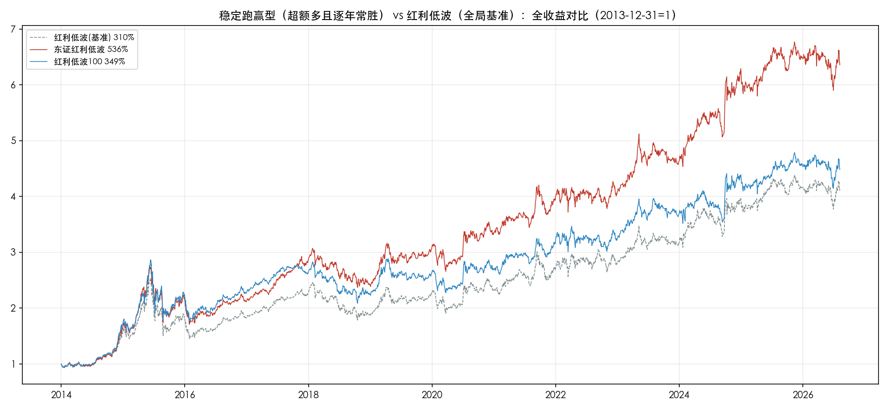
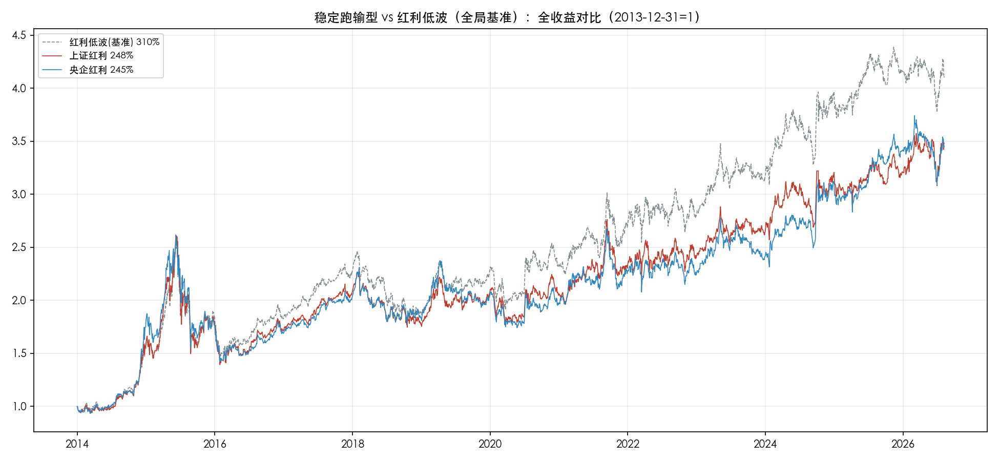
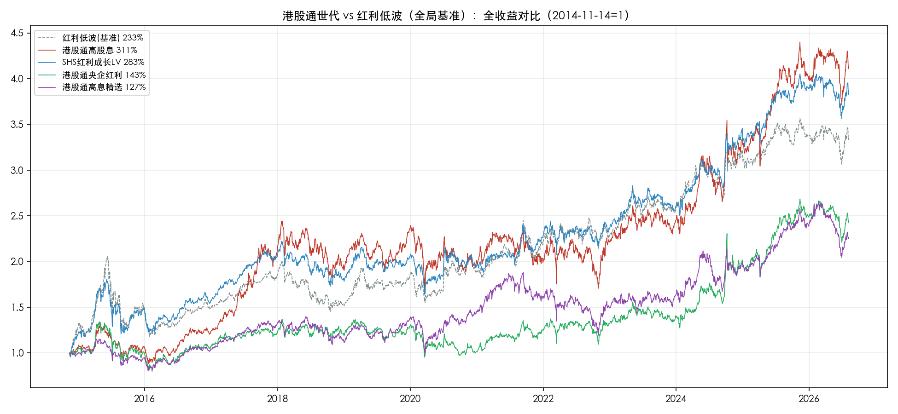

# 红利指数全景回测：22只指数拉到同一起跑线后，我理出了一份选基参考

打开中证官网，红利类指数有30只。名字都很像--红利、红利低波、红利质量、高股息、港股通红利……但把时间拉长看，同样是"红利"，12年总收益从588%到245%，差出2.4倍。

名字不能当依据，收益榜也不能直接信--因为每只指数的出生年月不同，有的2004年就已发布、每一段涨幅都是真金白银走出来的；有的2016年才定基日，一半"历史"是指数公司坐在办公室里回算出来的。直接比总收益，等于让不同年龄的人比身高。

本文做一件事：把30只红利类指数中可投资的22只（跟踪产品规模不达标已剔除），按**基日**分成三代，组内统一到同一条起跑线，用全收益口径（现金分红再投资）回溯到2026年8月7日。三代、22张成绩单，最后落到一个问题：如果你想配置红利指数，该怎么选。

先交代分组。三个基日不是随机分布，每代都有自己的时代背景：

- **2013前世代（15只）**：中证体系早期的老江湖，基日多扎堆在2004、2005年。上证红利、中证红利、红利低波都在这一代。组内统一从2013-12-31起算，窗口12.6年
- **港股通世代（4只）**：沪港通2014年11月17日开通，港股通标的名单自此时才存在，这批指数的基日清一色锚定开通前的最后一个交易日2014-11-14。窗口11.7年
- **央企定制世代（3只）**：国资委旗下资本运营公司（诚通、国新）找中证定制的央企红利系列，统一以2016年末为基期。窗口9.6年

组内窗口完全一致，表里的总收益、波动、回撤可以直接比。跨组之间不能直接比--窗口不同、跨越的市场阶段不同，这一点先说在前面。

下面一代代看。

## 一、2013前世代：老江湖的12.6年

| 指数 | 总收益 | 年化 | 近3年年化 | 波动 | 最大回撤 | 实盘胜率 | 回测占比 |
|---|---:|---:|---:|---:|---:|---:|---:|
| 中证红利质量 | 588.3% | 16.54% | 11.10% | 21.21% | -37.64% | 9/12 | 83% |
| 东证红利低波 | 535.9% | 15.81% | 9.02% | 18.47% | -37.72% | 10/12 | 50% |
| 红利质量 | 502.3% | 15.32% | 6.88% | 22.87% | -39.02% | 9/12 | 51% |
| 智选高股息 | 495.6% | 15.21% | 13.41% | 18.99% | -37.28% | 10/12 | 85% |
| A500红利低波 | 403.6% | 13.69% | 8.74% | 18.28% | -39.28% | 10/12 | 89% |
| 消费红利 | 349.5% | 12.67% | -8.31% | 23.87% | -46.17% | 8/12 | 0% |
| 红利低波100 | 348.5% | 12.65% | 4.60% | 18.86% | -38.74% | 11/12 | 27% |
| 香港红利 | 348.3% | 12.65% | 23.46% | 16.63% | -28.42% | 10/12 | 0% |
| 300红利低波 | 322.5% | 12.12% | 6.38% | 18.11% | -34.54% | 8/12 | 39% |
| 中证红利 | 315.6% | 11.97% | 6.93% | 20.09% | -45.66% | 9/12 | 0% |
| 红利低波 | 310.2% | 11.85% | 7.65% | 19.35% | -42.49% | 11/12 | 0% |
| 上国红利 | 302.1% | 11.68% | 10.44% | 19.92% | -42.70% | 8/12 | 0% |
| 红利价值 | 297.3% | 11.57% | 8.72% | 20.30% | -40.99% | 10/12 | 0% |
| 上证红利 | 248.2% | 10.41% | 8.73% | 19.89% | -46.54% | 9/12 | 0% |
| 央企红利 | 244.6% | 10.32% | 9.08% | 19.78% | -45.66% | 7/12 | 0% |

几列指标怎么读：**年化**是12.6年折算的复利；**回测占比**是窗口内发布日之前那段"回算收益"的比例，回算段没有一分钱真实交易；**实盘胜率**是12个完整年度里上涨年份的数量。

这张表先看两个方向。

**收益榜前五，四个含高回测。**中证红利质量83%、智选高股息85%、A500红利低波89%、红利质量51%--榜单头部大面积是"纸面成分"。而回测占比0%、每一分收益都由市场真实走出来的8只老指数里，成绩最好的红利低波100也只排第7，实盘验证最久的上证红利垫底。这不是巧合，后面第五节会量化它。

**回测少的里面也有赢家。**东证红利低波（回测50%）年化15.81%排第二、收益波动比0.86全组第一、12个年度10年上涨，且以红利低波为基准逐年对比，12年里9年跑赢、赢的分散不靠个别年份，回撤还比基准浅5个百分点--数据层面它是全组唯一"收益高+胜率高+回撤浅"的指数。但注意它的可投资性短板：跟踪产品只有一只场外基金（东方红中证红利低波动012708，规模65亿），成立至今累计跑输指数10.65个百分点，年化约1.8个点--指数画像和买到手的收益之间有一道系统性鸿沟。

再以红利低波为基准做归一化对比，15只大致分成四类，每类选代表图：

**稳定跑赢型**只有两只：东证红利低波（12年超额+225.7pp、9年胜基准）和红利低波100（+38.3pp、7年胜基准）。共同点是"红利+低波"双因子--低波因子在2018年单边熊市和2021-2023震荡市里天然抗跌，红利因子吃到2021年起的煤炭、银行高股息行情；东证还叠加了编制方的盈利稳定性偏好，2017年白马牛和2021年后的红利低波风格期都有超额。

**高超额但依赖个别时段型**是中证红利质量（+278.1pp）、红利质量（+192pp）、智选高股息（+185pp）、A500红利低波（+93.4pp）。共性扎眼：超额高度集中在2015-2020年质量因子行情段（2017白马牛、2019-2020核心资产抱团），2021年2月抱团瓦解后连续四年跑输基准，2025年质量因子回归才重新跑赢。一句话：**这类指数的超额与核心资产行情高度绑定，抱团终结即超额终结**。而智选高股息、A500红利低波还叠加了85%以上的回测占比--实盘期从未完整经历一轮抱团周期。

**与基准打平型**六只，三种"平庸"来源各不相同：中证红利（+5.4pp）是传统高股息宽基，各类行情各有得失；消费红利（+39.3pp）是"成也抱团败也抱团"的极端样本，2019年一度超额150pp+，近3年年化-8.3%全样本唯一负收益；香港红利（+38.1pp）路径最特殊--前段大幅落后、2022年港股见底后陡峭反超，回撤-28.4%全组最浅。

**稳定跑输型**两只：上证红利（-62.0pp、12年只赢3年）、央企红利（-65.6pp）。它们是"单一市场+传统高股息"选样，持仓集中在银行、煤炭、石化、交运，既没有低波防御加成，又没有进攻弹性，两头不占。

## 二、港股通世代：最干净的一组对照实验

这一组只有4只，却是全样本里最干净的：同基日、同基点、同窗口，差异100%来自选样策略，没有时代噪音。

| 指数 | 总收益 | 年化 | 近3年年化 | 波动 | 最大回撤 | 回测占比 |
|---|---:|---:|---:|---:|---:|---:|
| 港股通高股息 | 311.2% | 12.81% | 17.75% | 21.15% | -33.78% | 17% |
| SHS红利成长LV | 282.6% | 12.12% | 11.25% | 16.67% | -33.20% | 38% |
| 港股通央企红利 | 142.7% | 7.85% | 18.35% | 20.63% | -40.46% | 22% |
| 港股通高息精选 | 126.5% | 7.22% | 11.08% | 19.20% | -36.56% | 13% |

同样的11.7年，头尾差2.5倍，中间一刀切成两个梯队：港股通高股息和SHS红利成长LV年化12%+，港股通央企红利和高息精选只有7%出头。

两个值得记住的细节：

**"港股通红利整体强势"是个错觉。**同期A股基准红利低波年化10.81%，跑赢它的只有前两名，后两名连A股红利都跑不赢。强的不是"港股通"这个标签，是具体策略：高股息加权和沪港深低波成长。

**SHS红利成长LV是全组风控标杆。**全程波动16.67%、近3年13.30%双最低，回撤-33.2%最浅，收益波动比0.73组内第一。"沪港深+成长+低波"的复合选样，在风险端的贡献实打实。

## 三、央企定制世代：最年轻，也最需要打折读

| 指数 | 总收益 | 年化 | 近3年年化 | 波动 | 最大回撤 | 回测占比 |
|---|---:|---:|---:|---:|---:|---:|
| 诚通央企红利 | 132.8% | 9.20% | 9.98% | 18.60% | -27.34% | 66% |
| 国新港股通央企红利 | 132.4% | 9.18% | 14.72% | 18.79% | -38.79% | 70% |
| 央企股东回报 | 118.6% | 8.49% | 7.57% | 18.24% | -24.13% | 61% |

三只收益高度趋同（年化8.5%-9.2%），毕竟定制方同源、样本同池。分化全在风险路径：国新港股通央企红利回撤-38.8%最深，但近3年年化14.7%最猛，是港股央企估值重塑行情的直接受益者，也是3只中唯一6/9年跑赢A股基准的；央企股东回报回撤-24.1%最浅但收益垫底。高收益深回撤还是浅回撤低收益，这组把选择题摆得最直白。

更根本的问题是回测占比61%-70%：基日定在2016年末，实际发布在2022-2023年，前六年是回算，实盘验证只有3-4年。整张成绩单，先打六折再读。

## 四、跨世代：谁在衰减，谁在修复

把22只放在一起，最能说明当下格局的是长短期收益的对照（分界线为各组内中位数）：

- **长强短弱**：红利质量（12.6年年化15.3% -> 近3年6.9%）、消费红利（12.7% -> **-8.3%**）、红利低波100（12.7% -> 4.6%）--清一色A股质量/成长风格红利
- **长弱短强**：香港红利（12.7% -> 23.5%）、港股通央企红利（7.9% -> 18.4%）、国新港股通央企红利（9.2% -> 14.7%）--清一色港股暴露

方向由市场暴露决定，与指数哪一代出生无关：**A股质量红利在还债，港股红利在修复**。

波动率讲的是同一个故事。22只中19只近3年比全程更稳，"红利变稳"是A股现象--最稳的前五清一色纯A股低波系；变颠的只有3只，全部含港股（香港红利、港股通央企红利、国新港股通央企红利），近三年港股的暴涨暴跌还在窗口里。按市场暴露分组更直白：纯A股16只波动比（近3年÷全程）中位0.78，含港股6只为1.00--一个已经进入低波状态，一个还在颠簸。

## 五、读收益榜前，先了解"回测光环"

回到第一节留下的悬念：为什么收益榜头部扎堆高回测指数？

两个量化验证。其一，2013前组15只，回测占比与年化收益的相关系数达**0.81**--回测成分越高，展示收益越高。其二，把每只指数的统一窗口年化与"发布日之后实盘年化"相减（14只含回测段的指数），差值最大的五只：

| 指数 | 统一窗口年化 | 实盘年化 | 差值 | 回测占比 |
|---|---:|---:|---:|---:|
| 红利质量 | 15.32% | 7.99% | +7.3pp | 51% |
| 红利低波100 | 12.65% | 6.38% | +6.3pp | 27% |
| A500红利低波 | 13.69% | 7.61% | +6.1pp | 89% |
| 智选高股息 | 15.21% | 10.15% | +5.1pp | 85% |
| 300红利低波 | 12.12% | 7.74% | +4.4pp | 39% |

但注意回测占比那一列：差值大的不都是高回测--红利低波100只有27%回测，差值照样+6.3pp。说明差值里混着两种效应：一是回测偏差（编制方用这段历史选因子调参数，回测段天然偏乐观）；二是时代效应（这批指数发布日恰逢市场高位，此后经历2015年股灾和2018年熊市）。反过来的例子也有：国新港股通央企红利发布于2022年底部区域，实盘年化反而比全窗口高5.9pp。

结论：回测光环存在，但幅度被时代效应放大。实操含义很简单--**看任何指数的展示收益，先查基日和发布日差多远；隔得越远，心里的折扣打得越狠**。

另一个读榜细节：按总收益排与按收益波动比排，名次并不重合。被总收益低估的风控优等生：香港红利（收益第8、收益波动比第4）、东证红利低波（第2、第1）；被高估的高波动选手：消费红利（第6、倒数第3）、红利质量（第3、第7）--靠高波动换来的高收益，"拿得住"的代价没有体现在收益榜里。

## 六、落到选基：按需求对号入座

三代比赛看完，最后给一份分型参考。先说前提：以下全部基于历史回溯，指数的历史风格不保证延续，港股红利修复到什么阶段也无法预判；每类给出的是"验证过的方向"，不是推荐清单。

**要确定性：优先实盘验证充分的低波系**

候选：红利低波、红利低波100、300红利低波（回测占比0%-27%，12.6年全程实盘或接近全程，年化11.9%-12.7%，回撤-35%~-42%）。

这类指数的可信度最高--收益每一分都是市场走出来的，且红利+低波双因子在跌市有防御，年度胜率11/12或接近。代价是弹性一般：近3年年化4.6%-7.7%，不温不火。适合把红利当底仓、追求"拿得住"的投资者。东证红利低波数据更亮眼（年化15.8%、收益波动比全组第一），但需接受两点：回测占比50%，以及目前唯一的跟踪产品累计跑输指数10.65pp--指数好不等于基金好，买之前把这条落差算进预期。

**要弹性：港股红利修复线，用回撤换**

候选：香港红利、港股通高股息（近3年年化23.5%、17.8%，长期年化12.7%、12.8%，在22只中同时满足"长期不弱+近3年强"）。

这条线的逻辑是2022年10月港股见底后的估值修复：南向资金持续流入、高股息资产稀缺、央企估值重塑，目前仍在进行中。但要清醒两件事：一是回撤代价，港股红利2015-2021曾长期跑输A股基准，"输过程赢结果"的剧本随时可能重演；二是波动状态，含港股的指数近3年波动不降反升，和A股红利的"变稳"相反。适合作为红利组合里的弹性配置，不适合当唯一仓位。

**要均衡：沪港深复合策略**

候选：SHS红利成长LV（年化12.1%，全程和近3年波动双低，回撤-33.2%，收益波动比0.73）。

它在港股通世代里是风控标杆，"三地+成长+低波"的复合选样让它既吃到港股修复、又没放弃A股低波的防御，风险调整后收益在全样本里排前列。适合不想在A股和港股之间二选一的投资者。

**谨慎对待的两类**

高回测+高超额的质量类（中证红利质量、智选高股息、A500红利低波）：展示收益漂亮，但超额与核心资产行情绑定、回测占比51%-89%、实盘期短，2021-2024连续四年跑输基准的历史刚过去不久。2025年质量因子回归后它们重新走强，追不追，取决于你对"质量因子行情延续性"的判断，而不是那串好看的12年数字。

为什么回测数字要打折？回测段没有一分钱真按它交易过：参数可以照着历史答案反复调（过拟合），资金涌入会摊薄策略的超额（反身性），起点碰上哪段行情也看运气；而实盘数字是抢跑（套利资金比指数基金先一步买入，把该赚的差价截走）、拥挤、流动性摩擦全扣完的结果。折扣具体怎么打，第五节的实盘年化对照已经算过了。

不过把三只的编制方案翻出来逐条看，规则质量并不一样，处置可以有梯度：

- **智选高股息（规则最扎实，可进观察池）**：唯一不用"过去三年股息率"、改用**当年分红预案股息率**选样的--前瞻而非滞后，天然避开"跌出来的高息股"（价值陷阱温床）；每年5月调仓正好接住年报和分红预案披露完毕的时点。三只中唯一有独立"为什么应该有效"逻辑的一只。
- **中证红利质量（次之）**：规则自洽但六道筛选工序阈值全是精修数字，且核心链路被晚它大半年发布的A500红利低波逐字复用--同一套公式反复套壳，恰恰说明漂亮数字是"测出来的"，不是"推出来的"。
- **A500红利低波（成绩单参考价值最低）**：母指数A500自己2024年9月才发布，所谓2013年末起的业绩是用今天的成分名单往回套--先用后视镜选好股票池，再在池内做策略回测。叠加89%回测占比、实盘年化已输基准4个多点，那份13.69%的年化建议直接忽略。

（三只的编制规则明细见文末附录。）

单一市场老宽基（上证红利、央企红利）：不是不能买，而是同样条件下有更好的选择--12.6年跑输基准60pp以上、胜基准仅3-4年，既无防御加成又无进攻弹性。它们更适合作为"只要沪市/只要央企"这种特定约束下的工具。

**选基前的三个检查动作**

无论选哪类，下单前过一遍：

1. **查基日与发布日的距离**--隔得越远，展示收益打折越狠（第五节的方法）
2. **查跟踪产品**--ETF规模2亿以上、场外基金5亿以上才算合格，LOF和指数增强慎碰，再看看基金历史跟踪差（东证案例的教训）
3. **查长短期方向**--长期强近3年弱的要问"风格还在吗"，近3年爆发的要问"修复走到哪了"

红利指数投资，说到底就这三问：这收益是真的吗？这指数我买得到吗？这风格还能延续吗？22只指数的三代回测，答案都在数据里了。

---

## 附录：口径与筛选说明

### 三只高回测指数的编制规则明细

**中证红利质量（932315，2024年6月发布，基日2013-12-31）**：样本空间同中证全指，六道工序--①按市值和成交额排名剔除任一后20%；②过去三年连续现金分红、三年平均股利支付率10%-100%；③按过去三年平均现金股息率降序剔除后50%；④按过去12个季度ROE标准差升序取前80%；⑤ROE、ROE同比变化、经营现金流/总负债、现金分红/总市值四个指标分金融/非金融行业计算Z值合成综合得分；⑥取综合得分前50只，按得分倾斜加权（单票≤10%、前五大≤40%、单一级行业≤30%）。每半年调整一次。

**智选高股息（932305，2024年9月发布，基日2005-12-30）**：样本空间同中证全指，可投资性筛选为过去一年日均成交金额前90%；选样只需两步--过去三年连续现金分红+已披露当年现金分红预案，按**预案股息率**降序取前50只；按预案股息率÷过去一年波动率加权（单票≤10%）。每年5月第六个交易日调整一次，紧接年报和分红预案披露完毕的时点。

**A500红利低波（932422，2025年4月发布，基日2013-12-31）**：样本空间为中证A500指数样本（A500本身2024年9月发布）。选样三步--①连续三年分红、三年平均股利支付率0-1；②按过去12个季度ROE标准差升序取前80%；③按过去三年平均股息率降序取前50%，再按过去一年波动率升序取前50只；股息率加权（单票≤10%、单一级行业≤30%），每半年调整一次。其中②③与中证红利质量的工序③④实质相同。

（编制方案原文存档于 sources/index-methodologies/。）

- 样本：中证官网红利类指数30只（有跟踪产品），剔除跟踪产品规模不达标的8只（ETF<2亿、场外<5亿，LOF不计入达标），剩22只
- 分组按基日：≤2013-12-31为2013前世代；2014-11-14为港股通世代；2016-12-30为央企定制世代
- 组内统一到该组最晚基日起算，终点2026-08-07；全收益口径（现金分红再投资），人民币计价
- 年化波动为日频口径（日收益率标准差×√242），与中证官网快照一致；"近3年"为2023-08-08至今
- 年度胜率为完整年度（起算年次年至于2025年）正收益占比，2026年不完整不计入
- 回测占比=组内起点到发布日的天数÷窗口总天数
- 基准对比图中灰虚线为红利低波（H30269），2013前组按"超额收益+年度胜负+回撤差"分四类各选代表展示
- 数据来源：中证指数官网 index-perf 接口（全收益指数日收盘）、index-basic-info 接口（基日/发布日）

*本文为历史数据回溯，不构成投资建议。*
